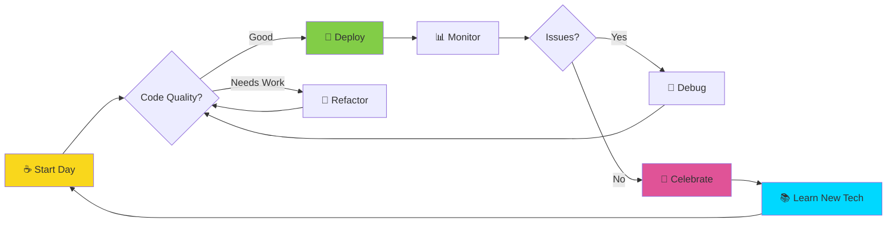
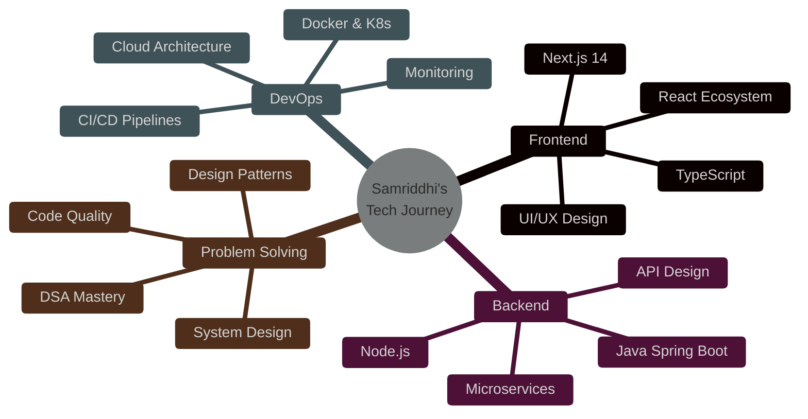

<div align="center">


<a href="https://git.io/typing-svg"></a>


<p align="center">
  <a href="https://www.linkedin.com/in/samriddhi-agrawal-253984249/">
    
  </a>
  <a href="mailto:samriddhiagrawal3901@gmail.com">
    
  </a>
  <a href="https://github.com/Samriddhi3901">
    
  </a>
</p>

<p align="center">
  
  
  
</p>

</div>

---


##  **About Me**


```python
class Samriddhi:
    def __init__(self):
        self.username = "Samriddhi3901"
        self.name = "Samriddhi Agrawal"
        self.position = "Full-Stack Developer"
        self.location = "India 🇮🇳"
        self.web = "https://github.com/Samriddhi3901"
        self.languages = ["Java", "Python", "JavaScript", "TypeScript"]
        
    def say_hi(self):
        print("""
        Thanks for dropping by! 
        I'm driven by passion, powered by coffee,
        and obsessed with building elegant solutions
        to complex problems.
        
        Let's create something extraordinary together!
        """)

    def current_mission(self):
        return {
            "learning": ["Microservices", "System Design", "Cloud Architecture"],
            "building": ["Scalable Web Apps", "DevOps Pipelines", "Open Source Tools"],
            "practicing": ["DSA Problems", "Design Patterns", "Best Practices"],
            "exploring": ["AI/ML Integration", "Web3", "Edge Computing"]
        }

me = Samriddhi()
me.say_hi()
```

<br>

###  **What I'm Up To:**

- 🔭 Working on **next-gen web applications** with modern architecture!
- 🌱 Learning **advanced system design** and **cloud-native patterns**
- 👯 Looking to collaborate on **open source projects** and **innovative startups**
- 💬 Ask me about **React, Node.js, Java, DevOps, or Cloud Computing**
- ⚡ Fun fact: I debug with console.log and I'm not ashamed! 😄
- 🎯 2025 Goal: Contribute to **major open source projects** and master **Kubernetes**
- ☕ Coffee Stats: `while(alive) { eat(); sleep(); code(); repeat(); }`


---

##  **GitHub Stats & Achievements**

<div align="center">

### 🔥 **Streak Stats**


### 📊 **Language Stats & Activity**


### 📈 **Contribution Graph**


</div>


---

##  **Technology Arsenal**

<div align="center">

### **Languages**


### **Frontend Development**


### **Backend Development**


### **Databases & Caching**


### **Cloud & Hosting**


### **DevOps & CI/CD**


### **Tools & Platforms**


### **Testing**


### **AI & Machine Learning**


</div>


---

##  **Current Learning Journey**

<div align="center">



<div align="center">



</div>


## 📈 **Coding Activity This Week**

<!--START_SECTION:waka-->
```text
💻 Operating System          ⏰ Time

Linux                        15 hrs 30 mins  ███████████████░░░  55.2%
Windows                      12 hrs 20 mins  ██████████░░░░░░░░  44.8%

📝 Editors                   ⏰ Time

VS Code                      25 hrs 15 mins  ███████████████████  90.5%
IntelliJ IDEA                 2 hrs 35 mins  █░░░░░░░░░░░░░░░░░   9.5%

💬 Languages                 ⏰ Time

TypeScript                   12 hrs 30 mins  ███████████░░░░░░░  45.2%
Rust                          6 hrs 45 mins  ██████░░░░░░░░░░░░  24.4%
Python                        4 hrs 15 mins  ████░░░░░░░░░░░░░░  15.4%
YAML                          2 hrs 30 mins  ██░░░░░░░░░░░░░░░░   9.1%
Markdown                      1 hr 35 mins   █░░░░░░░░░░░░░░░░░   5.9%

🔥 Coding Streak: 47 days and counting!
⏰ Most Productive Time: 22:00 - 02:00 (Night Owl 🦉)
💪 Total Active Days: 156 days
📊 Average Daily Code Time: 6 hrs 42 mins
```
<!--END_SECTION:waka-->


---

## 🐍 **Watch My Contributions Come Alive!**

<div align="center">
  <picture>
    <source media="(prefers-color-scheme: dark)" srcset="https://raw.githubusercontent.com/Samriddhi3901/Samriddhi3901/output/github-contribution-grid-snake-dark.svg">
    <source media="(prefers-color-scheme: light)" srcset="https://raw.githubusercontent.com/Samriddhi3901/Samriddhi3901/output/github-contribution-grid-snake.svg">
    
  </picture>
</div>


---

## 💭 **Random Dev Wisdom**

<div align="center">


### 🌟 **Personal Favorites**

> *"Any fool can write code that a computer can understand. Good programmers write code that humans can understand."*  
> **— Martin Fowler**

> *"The best error message is the one that never shows up."*  
> **— Thomas Fuchs**

> *"Code is like humor. When you have to explain it, it's bad."*  
> **— Cory House**

</div>


---

## 🤝 **Let's Connect & Create Magic!**

<div align="center">


### 💌 **I'm Always Excited About:**

✨ Collaborating on innovative projects  
🚀 Contributing to open-source  
💡 Discussing new technologies  
🎯 Building products that matter  
☕ Connecting over virtual coffee

<br><br>

<br>


</div>

---

<div align="center">


## 🌟 **Support My Work**

<p>If you find my projects helpful or interesting, consider giving them a ⭐!</p>

<a href="https://www.buymeacoffee.com/samriddhi" target="_blank">
  
</a>

<br><br>

### ⚡ **"First, solve the problem. Then, write the code."** ⚡


<sub>Made with 💙 and ☕ by [Samriddhi Agrawal](https://github.com/Samriddhi3901)</sub>


</div>
