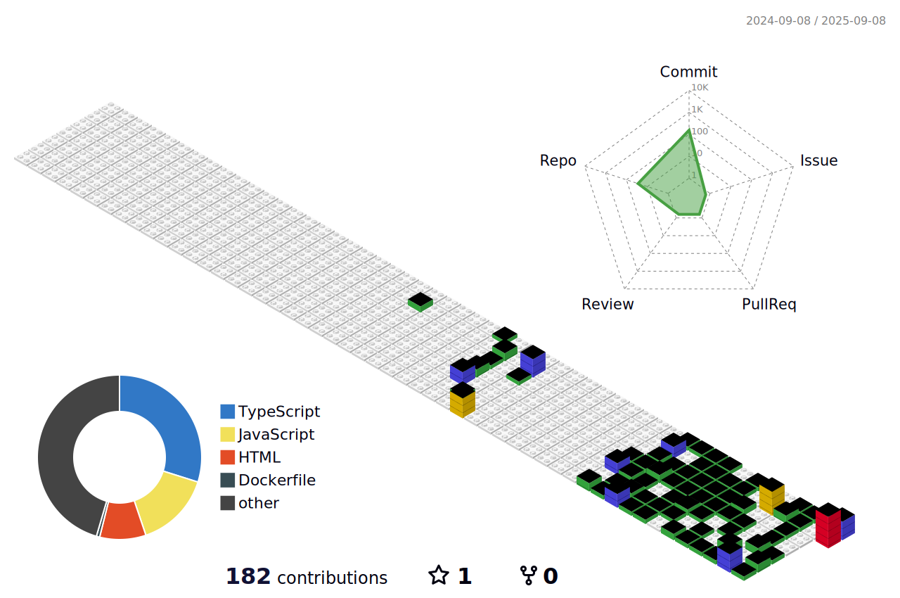

# Hey there, I'm Samriddhi! 👋 
<div align="center">
  
</div>

---

## 🚀 About Me

I'm a **cloud-obsessed engineer** ⚡ who lives at the intersection of **automation**, **scalability**, and **problem solving**. When I'm not architecting robust systems in the cloud, you'll find me diving deep into DevOps practices, building full-stack applications, or contributing to open-source projects that make developers' lives easier.

<div align="center">
  
</div>

---

## 📊 GitHub Statistics

<div align="center">
  
  
</div>

<div align="center">
  
</div>

<div align="center">
  
</div>

---

## 💪 My Superpowers

### ☁️ Cloud & DevOps Wizardry
```yaml
Cloud Platforms: AWS, Azure
Infrastructure: Terraform, CloudFormation
Containers: Docker, Kubernetes, ECS
CI/CD: Jenkins, GitHub Actions, GitLab CI
Monitoring: Prometheus, Grafana, CloudWatch
```

### 👩‍💻 Full-Stack Development
```javascript
const mySkills = {
  frontend: ["React", "Next.js", "TypeScript", "Tailwind CSS"],
  backend: ["Node.js", "Python", "Express", "FastAPI"],
  databases: ["MongoDB", "PostgreSQL", "Redis", "DynamoDB"],
  tools: ["Git", "VS Code", "Postman", "Docker"]
}
```

### 🧩 Problem-Solving Pro
- 🎯 **400+ DSA problems** conquered
- 🏆 **LeetCode warrior** with optimization skills
- 🔄 Turning complex challenges into elegant solutions

---

## 🎵 Currently Listening To
<div align="center">
  
</div>

---

## 📝 Latest Blog Posts
<!-- BLOG-POST-LIST:START -->
<!-- BLOG-POST-LIST:END -->

---

## ⚡ Recent Activity
<!--START_SECTION:activity-->
<!--END_SECTION:activity-->

---

## 🔥 Streak Stats & Contributions
<div align="center">
  
</div>

---

## 🐍 Watch My Contributions Get Eaten!
<div align="center">
  
</div>

---

## 🏆 Coding Platform Stats

<div align="center">
  
</div>

---

## ⏱️ WakaTime Weekly Stats
<!--START_SECTION:waka-->
<!--END_SECTION:waka-->

---

## 🎲 Random Dev Joke
<div align="center">
  
</div>

---

## 🌟 Featured Projects

<div align="center">
  <a href="https://github.com/Samriddhi3901/CI-CD-NextApp">
    
  </a>
  <a href="https://github.com/Samriddhi3901/devops-node-stack">
    
  </a>
  <a href="https://github.com/Samriddhi3901/SynkNode">
    
  </a>
  <a href="https://github.com/Samriddhi3901/WhiteSpace-Socket.io">
    
  </a>
</div>

---

## 🏃‍♀️ Fun Facts
- 🧩 **Speedcuber**: My Rubik's cube and I have a love-hate relationship
- 🌱 Currently geeking out over **AI/ML** and **serverless tech**
- 🤝 **Collaboration Enthusiast**: My best work happens in teams
- 📚 **Continuous Learner**: Always exploring new tech frontiers
- ☕ Coffee-driven development is my specialty

---

## 📊 Visitor Stats
<div align="center">
  
  
</div>

---

## 💬 Let's Connect!

<div align="center">
  <a href="https://www.linkedin.com/in/samriddhi-agrawal-253984249/">
    
  </a>
  <a href="https://github.com/Samriddhi3901">
    
  </a>
  <a href="mailto:your-email@example.com">
    
  </a>
</div>

---

## 🎯 What I'm Up For

✅ **Collaborating** on innovative projects  
✅ **Discussing** cloud architectures and automation  
✅ **Sharing** speedcubing tips (or learning yours!)  
✅ **Connecting** with fellow tech enthusiasts  
✅ **Mentoring** and knowledge sharing  

---

<div align="center">
  <h3>🚀 Let's Build Something Amazing Together! 🚀</h3>
  
</div>

---

### 📈 Contribution Graph

